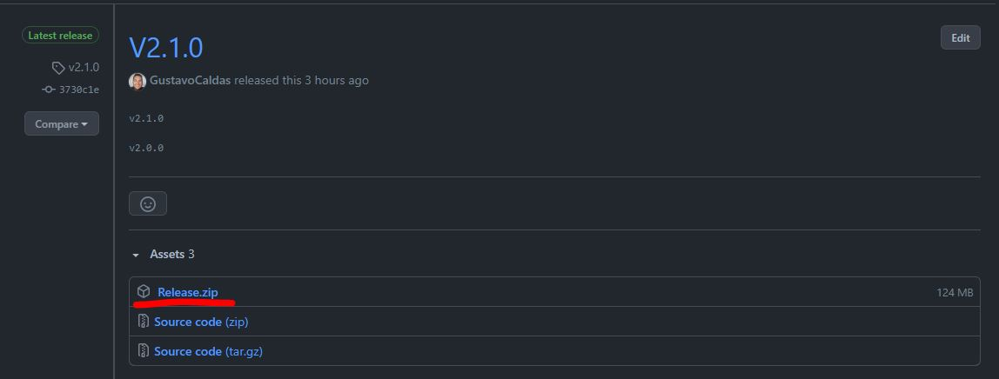
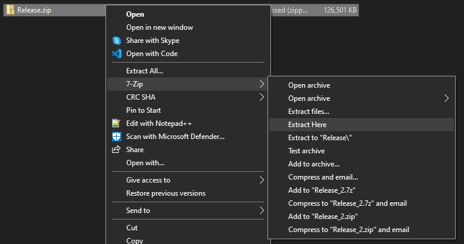
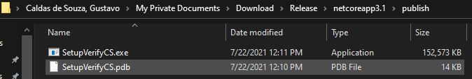
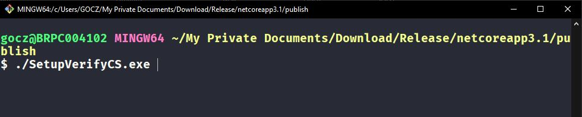

## VerifySetupCS - Software modelado para verificar se o ambiente está de acordo ao CS
### Software Windows Forms desenvolvido utilizando .NET Core
---

<p align="center">


<p>

---


#### Pré requisitos
* 7Zip ou algum descompactador (.zip)
* Git (caso queria clonar o repositório)

---

#### Como eu utilizo o software na minha máquina local ?

* Vá em releases

* Baixe a última versão .zip

* descompacte em sua máquina

* entre na pasta até chegar no arquivo **SetupVerifyCS.exe** (Release/netcoreapp3.1/publish)

* execute o comando abaixo para inicializar o software

```
./SetupVerifyCS.exe
```


#### Como eu clono o software para a minha máquina local ?

Execute no seu terminal:
```
git clone https://github.com/GustavoCaldas/CitrixForms.git
```

---

