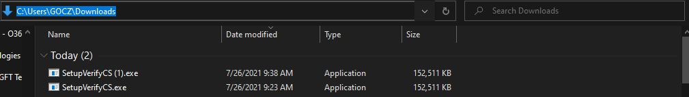

## VerifySetupCS - Software modelado para verificar se o ambiente está de acordo ao CS
### Software Windows Forms desenvolvido utilizando .NET Core
---

<p align="center">


<p>

---
#### Como eu posso utilizar o software na minha máquina local ?

* Vá em releases


* Baixe a última versão executável (.exe)

.JPG)

* permita que seu navegador baixe o software


.JPG)

* abra o terminal na pasta


.JPG)

* execute o comando abaixo para inicializar o software

```
SetupVerifyCS.exe
```


---

